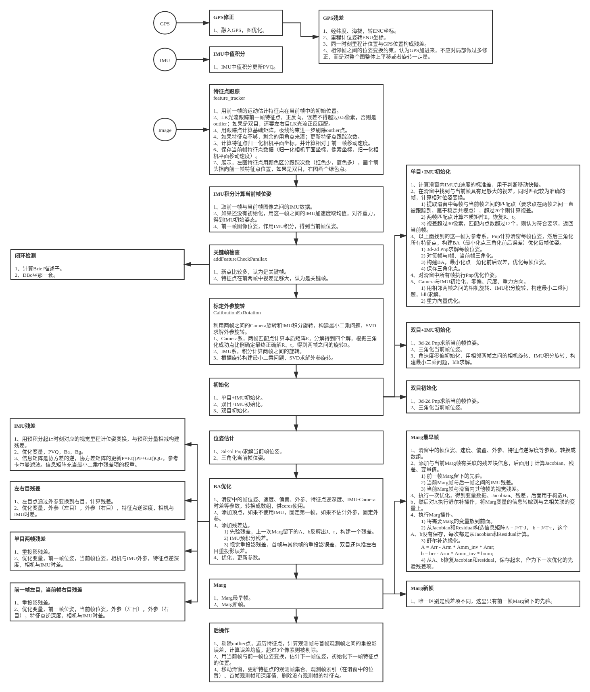

# Robust-VINS

## 配置环境
- ROS Noetic
- Eigen 3.3.7
- Ceres 2.1.0

```shell
mkdir -p ws_robust_vins/src
cd ws_robust_vins/src
git clone https://github.com/Derkai52/Robust-VINS.git
catkin_make
```

## 使用流程
```shell
# 测试bag包
rosbag play src/robust_vins/config/M300/100_4.bag
roslaunch vins M600.launch
```

## 流程图

